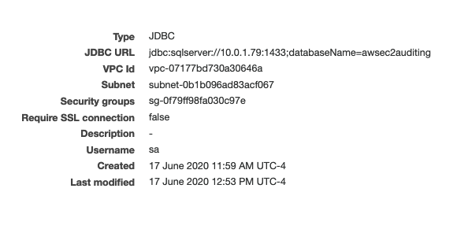
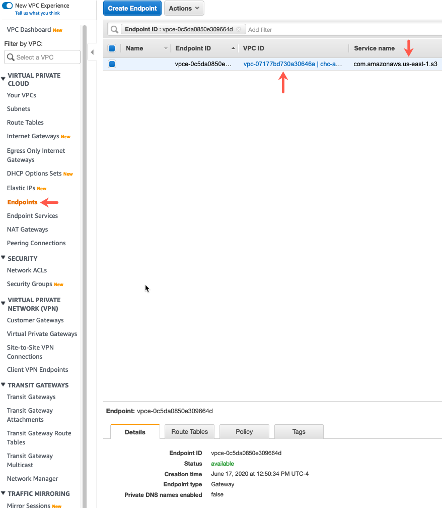
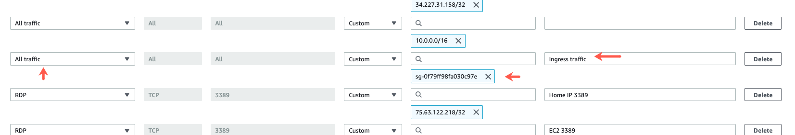
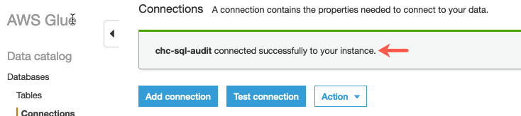

# SQL Server Auditing

## Follow the sequence and create the following audits and database structure on EC2 Server.

#### Audit definitions are created as per need

***Audit Definitions***

1. Create server audit - [Master Audit](auditspec/masteraudit/masteraudit.audit.sql)

    The server audit contains the master audit file.

2. Create DB audit specification  - [DB Audit](auditspec/databaseaudit/dbaudit.audit.sql)

    DB Audit contains specfications related to objets in database.

#### Current process extracts the data once and updates the tracking. Running the same query again would extract next set of data and already extracted data cannot be extracted again once the tracker gets updated.

***Database Schema***

1. Create database - [Database](awsec2auditing/awsec2auditing.db.sql)

    This database contains the schema to extract the data from audit file.

2. Create tracker table - [Audit Tracker](awsec2auditing/dbo.audittracker.table.sql)

    This table keeps the track of previous audit data pulls

3. Create procedure - [Audit Extract](awsec2auditing/dbo.auditextract.procedure.sql)

    This procedure extracts the audit data and update the tracker. 

***Configure AWS***

1. Create new AWS Glue Connection

    * Open AWS Glue and click on Connection then add new connection with following settings
     

    * Also create VPN End Point for S3 and attach it to the VPC mentioned above.
    

    * Add ingress traffic to the security group assigned to Glue Connection to allow all traffic within security group
    

    * Create and select a role that has access to S3 (and RDS if destination is RDS). Test the connection and it should connect successfully.
    

